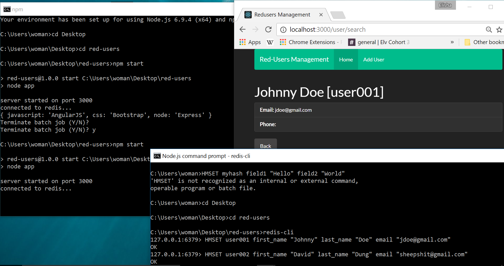

After git cloning and npm installing, Open 2 Command prompts

<a href="https://www.youtube.com/watch?v=9S-mphgE5fA&t=1331s">Watch Tutorial Here</a> 

<a href="https://www.youtube.com/watch?v=jTTlBc2-T9Q">Dave Nielsen: Top 5 uses of Redis as a Database</a> 

Redis Commands

example: HMSET user001 first_name "Johnny" last_name "Doe" email "jdoe@gmail.com"

<a href="https://redis.io/commands/hmset">Read More Here</a> 